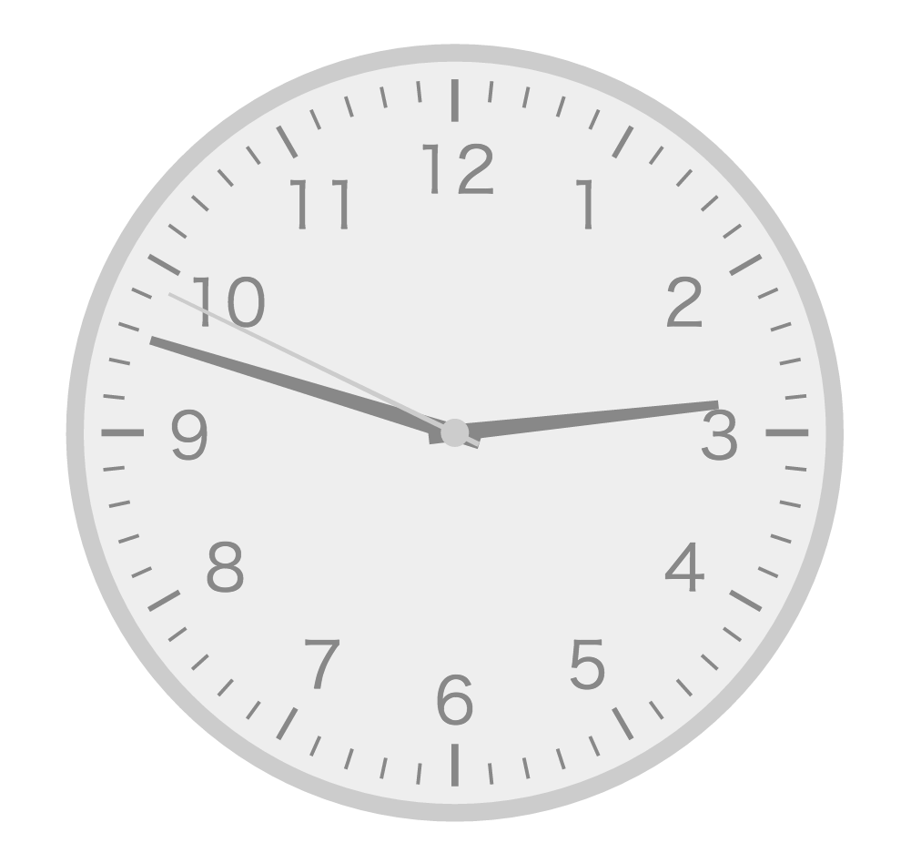

# Simple Analog Clock

## 概要

とてもシンプルなアナログ時計です。  
Reactを使用して、SVGを描画しています。

[Sample(Github Pages)](http://sy-hash.github.io/react-svg-clock/)

## 留意点

ローカル上では、ローカルファイル読み込みが発生するため、Chromeなどでは正常に動作しません。  
サーバーに配置するか、Chrome で開く場合は "-allow-file-access-from-files" オプションを使用してください。

## Library

* React  
  https://facebook.github.io/react/
